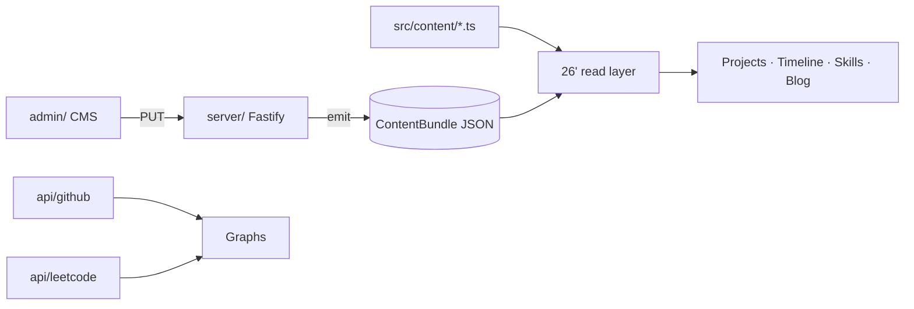

# 26' Edition — Master Blueprint

**Edition:** Kelly.OS 2026 (the "26'" era)
**Route:** `/2026` (single page) + `/2026/terminal`, `/2026/blog`, `/2026/blog/:slug`
**Status:** Phase 0 built · Phases 1–8 specified
**Authored:** 4 September 2026

---

## 1. What the 26' edition is

The 1996 desktop was chapter one: a maximalist, colorful, retro operating system where the
metaphor carried the argument. The 2026 edition is its deliberate opposite — a **calm,
monochrome, editorial portfolio** that lets the work speak with as little chrome as
possible. Same person, later chapter; the contrast *is* the narrative.

Reaching it is already wired: on the 96' desktop, *Install update* plays the black-hole
video and navigates to `/2026`. This edition is what lives there.

### 1.1 Design thesis

> Minimalism is not the absence of design — it is design carried entirely by **typography,
> whitespace, hierarchy, and motion**. Remove color as a crutch and those four have to be
> excellent.

This is the single rule that resolves most arguments in these docs. If a section looks
flat, the fix is stronger type/space/motion — **not** adding color.

### 1.2 Relationship to the 96' edition

| | 96' (ORIGIN) | 26' (this) |
|---|---|---|
| Mood | Maximalist, playful, retro | Minimal, editorial, calm |
| Color | Full Win95 palette | Monochrome grayscale system |
| Layout | Window manager, desktop | Single-page scroll + routes |
| Motion | Window open/close, boot | Scroll-reveal, parallax, smooth scroll |
| Type | W95FA / MS Sans | Source Serif display + Source Sans + IBM Plex Mono |
| Code | `src/shell`, `src/wm`, `src/apps` | `src/twentysix/` (isolated) |

The two share **one content source** (`src/content/*`) so facts never diverge, but share no
CSS or components.

---

## 2. Principles (the rules every phase obeys)

1. **Grayscale is a system, not two colors.** ~10 steps from near-black canvas to off-white
   ink, plus muted greys and hairline borders. Never literal `#000`/`#fff` slabs. See
   [design-system.md](design-system.md).
2. **Mobile is designed in every phase**, never retrofitted. Each section ships a desktop
   *and* a mobile blueprint together.
3. **Every data/asset dependency has a fallback.** Missing portrait, dead API, empty blog,
   bad slug, slow network, unverified link — each degrades gracefully. See §6.
4. **Motion carries hierarchy** and is always reduced-motion-gated with a correct static end
   state.
5. **Audience A wins.** A recruiter must reach the work fast; theatre never blocks evidence.
   (Inherited from the 96' blueprint — still true.)
6. **Honesty of claims.** Reuse the content model's `verified` flags; unverified links never
   render as live buttons.
7. **Isolation.** All 26' code lives under `src/twentysix/`; nothing leaks into the retro OS.

---

## 3. Architecture

### 3.1 Module layout

```
src/twentysix/
  TwentySixHome.tsx          # /2026 — composes all sections, Lenis root, era canvas
  TwentySixNotFound.tsx      # /2026/* — monochrome 404
  styles/tokens26.css        # grayscale tokens, type scale, spacing, motion, primitives
  motion/
    scroll.ts                # Lenis + ScrollTrigger wiring, smoothScrollTo()
    reveal.ts                # revealOnScroll / revealStagger helpers
  components/
    primitives/              # Section, Reveal, Skeleton, ImageWithFallback
    SectionPlaceholder.tsx   # chunk-0 slot holder (replaced per phase)
    <section components>     # Hero, Dock, About, Projects, TechStack, Graphs, Timeline, Contact, Footer, fx/*
  pages/
    TwentySixTerminal.tsx
    Blog.tsx / BlogPost.tsx
  data/                      # dock config, graph usernames, hand-authored about copy
api/                         # Vercel serverless: github.ts, leetcode.ts (repo root)
```

### 3.2 Routing

Added in `src/App.tsx` (React Router 7), with matching `vercel.json` rewrites:

```
/2026            → TwentySixHome
/2026/terminal   → TwentySixTerminal
/2026/blog       → Blog
/2026/blog/:slug → BlogPost
/2026/*          → TwentySixNotFound   (stays in-era, never redirects to retro)
```

96' remains the default front door (`/`). 26' is also directly reachable.

### 3.3 The scroll lock (important)

The retro app is a fixed-viewport shell (`html`/`body`/`#root` are `height:100%;
overflow:hidden`). The 26' site needs normal document scrolling, so while a 26' route is
mounted, `TwentySixHome` sets `data-era26-active` on `<html>` and `tokens26.css` releases
those constraints; the attribute is removed on unmount so the retro desktop is untouched.

### 3.4 Content & data flow



Projects, timeline, skills, and the new blog are **read from the shared content source**.
Graphs are fetched live from serverless endpoints. The CMS/emit backend is infra-blocked in
production (Phase 16) but not code-blocked; static `src/content/*` is the live read path
meanwhile.

### 3.5 Dependencies

- **Existing:** React 19, React Router 7, Tailwind v4, GSAP 3.15, Zustand.
- **Added for 26':** `lenis` (smooth scroll). `gsap/ScrollTrigger` ships inside GSAP.
- **Per-component (isolated to `src/twentysix/`):** sent 21st components may pull `motion`
  (framer-motion) or `three`/OGL (globe, aether-flow). These do not touch the 96' GSAP-only
  rule.

---

## 4. Section order & responsibilities

| # | Section | We build / Slot | Reference | Phase |
|---|---------|-----------------|-----------|-------|
| — | Hero | Layout ours; particle-text + aether = slots | [1](references/README.md), [14](references/README.md) | 1 |
| — | Dock | Slot (21st) | [2](references/README.md) | 1 |
| 01 | About | Ours (rotated cards) | [3](references/README.md) | 2 |
| 02 | Projects | Slot + ours (modal, placement) | [6](references/README.md) | 3 |
| 03 | Tech stack | Slot (globe) + ours (skill bars, graphs) | [4](references/README.md), [5](references/README.md) | 4 |
| 04 | Timeline | Ours (GSAP) | [7](references/README.md) | 2 |
| 05 | Contact | Slot | [8](references/README.md) | 7 |
| 06 | Footer | Slot + minimal hover | [9](references/README.md), [15](references/README.md) | 7 |

Separate routes: **Terminal** (Phase 6), **Blog** (Phase 5).

---

## 5. Cross-cutting: motion

- One smooth-scroll instance (Lenis) at the page root, bound to the GSAP ticker and
  `ScrollTrigger.update`. Disabled under reduced motion (native scroll) and left native on
  touch.
- Durations come from CSS tokens (`--t26-dur*`) read via `durationSeconds`, mirroring the
  retro `src/motion/play.ts` convention.
- Standard reveals via `<Reveal>` / `revealStagger`; bespoke section motion (timeline draw,
  globe rotation) lives in that section's component but still uses the tokens + reduced-motion
  gate.
- **Every animation has a defined static end state** for reduced motion and for the
  no-JS/prerender fallback.

See [design-system.md §5](design-system.md#5-motion).

---

## 6. Cross-cutting: resilience & fallbacks

| Failure | Behavior |
|---------|----------|
| GitHub API down / rate-limited / no token | Graph shows skeleton → fallback card + link to profile; never a hole |
| LeetCode API down / user not found | Same skeleton → fallback pattern |
| Missing portrait | `ImageWithFallback` renders a sized monochrome initials placeholder |
| Missing / stale resume PDF | Resume button becomes disabled with a "coming soon" note, not a dead link |
| Unverified project link | Not rendered as a live button (honors `ExternalLink.verified`) |
| Empty blog | Intentional empty state, not a broken grid |
| Bad blog slug | Monochrome NotFound with back-to-blog |
| Slow network | Skeletons + Suspense boundaries; images lazy with placeholder; fetches time out + abort |
| Reduced motion | Every section has a correct static end state |

These are **built into each component**, not deferred to Phase 8.

---

## 7. Cross-cutting: mobile

Breakpoints in `tokens26.css`. Guarantees:

- Body never scrolls horizontally; wide content scrolls inside its own container.
- Every interactive target ≥ 44px; safe-area insets respected for the dock.
- Heavy visuals (globe, particle fields) degrade to static/reduced forms on small/low-power.
- Each phase doc has an explicit **Mobile** section and a mobile wireframe.

---

## 8. Acceptance criteria for the edition

| # | Criterion |
|---|-----------|
| E1 | The transition lands on a complete, scrollable, monochrome portfolio (not a placeholder) |
| E2 | A visitor can reach projects within one scroll / one dock tap |
| E3 | Works and looks intentional at 375px, 768px, and desktop |
| E4 | No console errors; no horizontal overflow; Lighthouse a11y ≥ 95 |
| E5 | Every failure in §6 degrades gracefully (demonstrated) |
| E6 | Reduced-motion users get a fully legible static experience |
| E7 | Terminal and blog are reachable and functional from the dock |
| E8 | Blog is editable in the CMS and renders published posts |

---

## 9. Open decisions / user inputs needed

Tracked per phase, summarized:

- Social URLs (GitHub/LinkedIn/email) — reuse 96' content or provide.
- Portrait image + updated resume PDF.
- GitHub + LeetCode usernames + a read-only `GITHUB_TOKEN`.
- Dock item list (default proposed in Phase 1).
- The 21st components per slot (Phases 1, 3, 4, 7).
- Whether 96' *shutdown* should also feed the transition (currently only *Install update* does).
