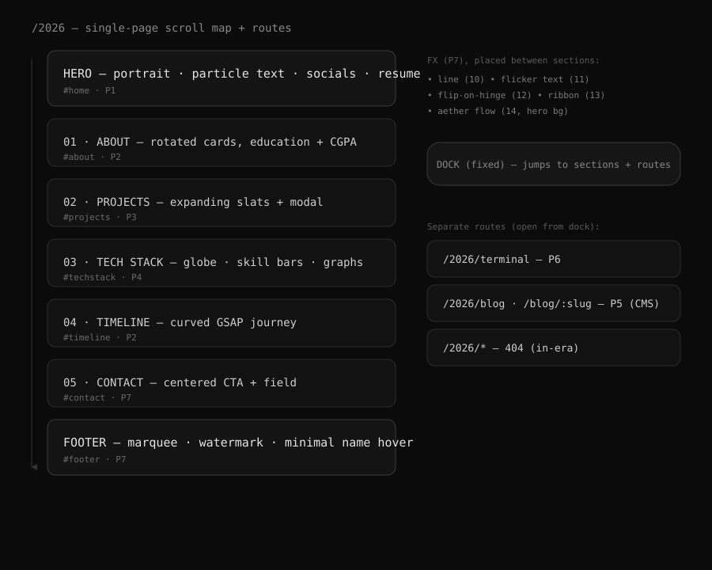

# Phase 0 — Foundation & Design System

**Status:** ✅ Built & verified · **Depends on:** — · **Route:** `/2026`

## Goal

Stand up the isolated 26' module, the grayscale design system, the smooth-scroll + reveal
motion layer, shared primitives, routing, and a scrollable home that lays out every section
in final order as on-brand slots. Prove tokens + responsive + motion end-to-end.

**In scope:** tokens, motion, primitives, routing, scroll-lock release, section slots.
**Out of scope:** any real section content (Phases 1+).

## Blueprint — page map

## What was built

| Area | File(s) |
|------|---------|
| Grayscale tokens, type scale, spacing, motion, primitives CSS | `src/twentysix/styles/tokens26.css` |
| Smooth scroll (Lenis + ScrollTrigger) + `smoothScrollTo` | `src/twentysix/motion/scroll.ts` |
| Reveal helpers (`revealOnScroll`, `revealStagger`) | `src/twentysix/motion/reveal.ts` |
| Primitives | `components/primitives/{Section,Reveal,Skeleton,ImageWithFallback}.tsx` |
| Slot holder | `components/SectionPlaceholder.tsx` |
| Home (era canvas, scroll lock release, section order) | `TwentySixHome.tsx` |
| In-era 404 | `TwentySixNotFound.tsx` |
| Routing | `src/App.tsx` (`/2026`, `/2026/*`) |
| Deploy rewrites | `vercel.json` (`/2026`, `/2026/(.*)`) |
| Dependency | `lenis` added to `package.json` |

## Key decisions captured

- **Scroll-lock release:** retro app locks `html/body/#root` to `100vh; overflow:hidden`.
  `TwentySixHome` sets `data-era26-active` on `<html>`; `tokens26.css` releases those on 26'
  routes only and restores on unmount.
- **GSAP boundary:** the repo's gsap-import test only guards `src/wm/core.ts`, so no test
  change was needed. All 26' GSAP still lives under `src/twentysix/motion/`.
- **CSS import:** `tokens26.css` is imported by `TwentySixHome` so it ships in the lazy 26'
  chunk, not the retro bundle.

## Verification (done)

- `/2026` renders the monochrome hero + all seven section slots.
- Page scrolls (`scrollHeight` 4150 vs viewport 794); reveals fire on scroll.
- No console errors; no horizontal overflow at 375px; mobile hero stacks cleanly.
- `tsc -b` clean.

## Acceptance criteria

- [x] Isolated module renders at `/2026` with no retro CSS bleed.
- [x] Grayscale tokens + type scale applied via `[data-era26]`.
- [x] Smooth scroll works; reduced-motion path uses native scroll.
- [x] Primitives usable by later phases.
- [x] 404 stays in-era.
