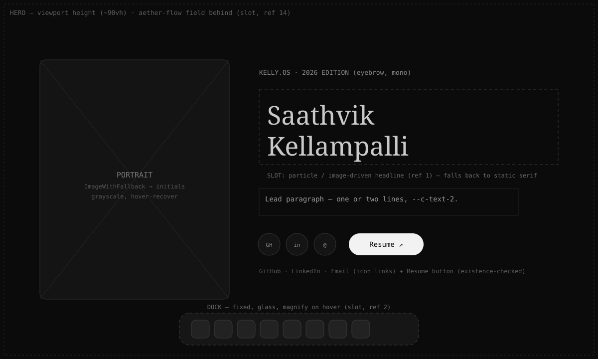
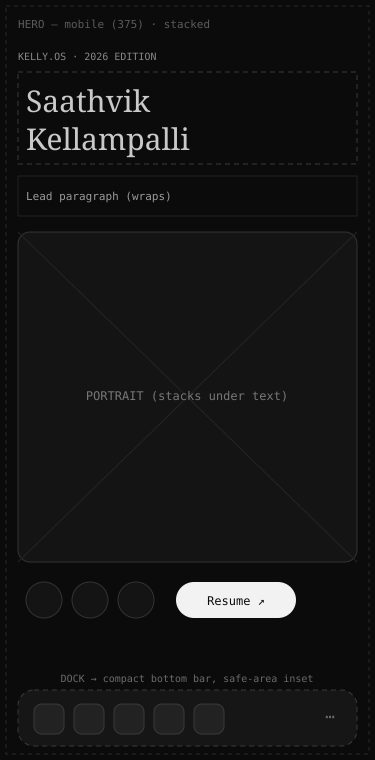

# Phase 1 — Hero & Dock

**Status:** ◧ Partially built · **Depends on:** P0 · **Section:** Landing (`#home`) + persistent dock

## Build status (2026-09-05)

- ✅ **Dock — DONE.** Persistent liquid-glass bottom nav (`components/Dock.tsx`,
  `styles/dock.css`, `components/icons.tsx`, `data/dock.ts`). Ported a 21st.dev macOS
  glass dock into the monochrome system (grayscale line icons, neutral glass — the
  chromatic filter primitives were dropped + backdrop `saturate(0)` so it never picks up
  a hue). IntersectionObserver scroll-spy (active dot), `smoothScrollTo` nav, resume link,
  mobile-compact, reduced-motion safe.
- ✅ **Portrait — DONE.** Full-bleed, full-colour, full-body portrait on the left
  (`components/primitives/ImageWithFallback.tsx` gained `grayscale`/`frame` toggles;
  `styles/hero.css`). `object-fit: contain` (never cropped), left inset, and a
  `mask-image` bottom vignette so it dissolves into the black canvas. Served from
  `public/content-assets/portrait.jpg`.
- ✅ **Name typography — DONE via `WarpText`** (`components/WarpText.tsx`) — canvas warp of
  the name (travelling sine + pointer bulge + ripple + subtle chromatic split), built to a
  21st/React-Bits `WarpText` API the user sent usage-only; fits font to width, static under
  reduced motion. Renders the hero `<h1>` "Saathvik Kellampalli".
- ✅ **Ambient background — DONE via `LightRays`** (`components/LightRays.tsx`) — raw-WebGL
  fragment-shader god-rays (origin/color/speed/spread/length/mouse-follow/noise/distortion),
  transparent canvas behind the hero content (`.t26-hero__rays`, opacity ~0.7). Cyan `#00ffff`
  as the user specified (⚠ off the monochrome palette — easy to swap to white/blue).
- ✅ **Socials + description — DONE.** `components/Socials.tsx` + `data/socials.ts` +
  `styles/socials.css` — monochrome icon row (GitHub broskell · LinkedIn kellampalli-saathvik ·
  LeetCode kellysolves · Instagram saathvikkellampalli · Email saathvik.kp@gmail.com), hover→blue,
  tooltips. Real hero description copy in. Eyebrow "KELLY.OS · 2026 EDITION" removed. Name enlarged
  (two-line, fills the full body column; WarpText fit factors raised to 0.96/0.94).
- **Hero Phase 1 is now feature-complete.**

## Goal

The first screen after the black transition: a two-column hero (portrait + image-driven
headline, socials, resume) over an ambient field, plus a persistent macOS-style dock that
navigates the whole site.

## Reference images

- **Particle headline** — `references/01-design-particle-text.png` — dot/particle wordmark that scatters.
- **Dock** — `references/02-macos-dock.png` — glass dock with icons + "How can I help you today?" pill.
- **Aether flow** — `references/14-aether-flow.png` — mono particle network reacting to cursor (hero background).


## Blueprint

**Desktop**



**Mobile**



## Layout & component tree

```
<Hero> (#home, ~90vh)
  <AetherFlow/>            ← slot (ref 14), absolute background, pointer-reactive
  grid [portrait | content]
    <ImageWithFallback>    ← portrait, initials fallback
    <div>
      eyebrow "KELLY.OS · 2026 EDITION"
      <ParticleText/>      ← slot (ref 1); static serif fallback = name
      lead paragraph
      <Socials/>           ← GitHub · LinkedIn · Email icon links
      <ResumeButton/>      ← opens /Saathvik_Kellampalli_Resume.pdf (existence-checked)
<Dock/>                    ← slot (ref 2), fixed bottom, all pages
```

- Desktop: two columns, portrait left (~380px), content right, intentional asymmetry.
- Mobile: stack — eyebrow, headline, lead, portrait, socials/resume; dock becomes a compact
  bottom bar with an overflow (⋯).

## Data contract

```ts
// src/twentysix/data/site.ts
interface SocialLink { kind: "github" | "linkedin" | "email"; label: string; url: string; }
const socials: SocialLink[]         // reused from 96' content if present, else provided
const RESUME_URL = "/Saathvik_Kellampalli_Resume.pdf"
// src/twentysix/data/dock.ts
interface DockItem { id: string; label: string; icon: ReactNode; to: string | (()=>void); }
```

**Dock default items:** Home · Projects · Tech · Timeline · Terminal · Blog · Contact ·
Resume. The "How can I help you today?" pill is optional and may wire to the existing
Kelly.AI engine (`src/apps/kellai`) — deferred.

## Motion

- Hero: staggered reveal of eyebrow → headline → lead → actions on mount (`--t26-dur`).
- Particle text: its own animation (from the sent component); static fallback under reduced
  motion / mobile / low-power.
- Aether flow: capped particle count; disabled under reduced motion; never intercepts scroll.
- Dock: icon magnify on hover (desktop only), spring per the sent component; active-route
  indicator.

## Mobile

- Portrait stacks under the headline; display font clamps down (see `--fs-display` at 640px).
- Dock → compact fixed bottom bar, `env(safe-area-inset-bottom)`, ≥44px targets, overflow menu.
- Particle text renders static; aether flow off by default under 768px.

## Fallbacks / resilience

- **No portrait:** `ImageWithFallback` shows sized initials placeholder ("SK").
- **Resume missing:** button disabled + "resume coming soon" title (a `HEAD` check or a build
  flag), never a dead link.
- **Particle/aether unavailable or reduced motion:** static serif headline, no field.

## Files

- Create: `components/Hero.tsx`, `components/Dock.tsx`, `components/fx/AetherFlow.tsx` (slot),
  `components/hero/ParticleText.tsx` (slot), `components/hero/Socials.tsx`,
  `components/hero/ResumeButton.tsx`, `data/site.ts`, `data/dock.ts`.
- Modify: `TwentySixHome.tsx` (replace hero placeholder + mount `<Dock/>`).

## Integration slots

| Slot | Component (21st) | Ref |
|------|------------------|-----|
| `ParticleText` | image-driven scatter text | 1 |
| `Dock` | macOS dock | 2 |
| `AetherFlow` | particle network bg | 14 |

## Acceptance criteria

- [ ] Hero fills first viewport; portrait + headline + socials + resume present.
- [ ] Dock is fixed, navigates to every section and to /terminal, /blog.
- [ ] Missing portrait & missing resume degrade gracefully.
- [ ] Mobile stacks; dock is a safe-area bottom bar; no horizontal overflow.
- [ ] Reduced motion: static headline, no field, dock still usable.

## Inputs needed

Social URLs (or confirm reuse from 96'); portrait image; dock item confirmation; the three
slot components.
