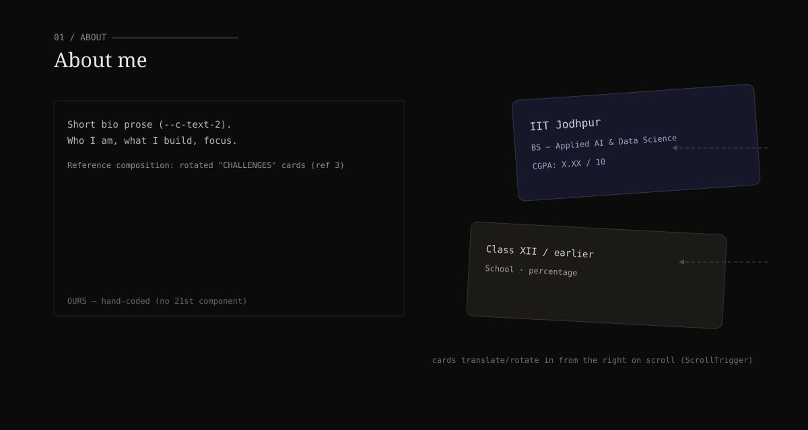
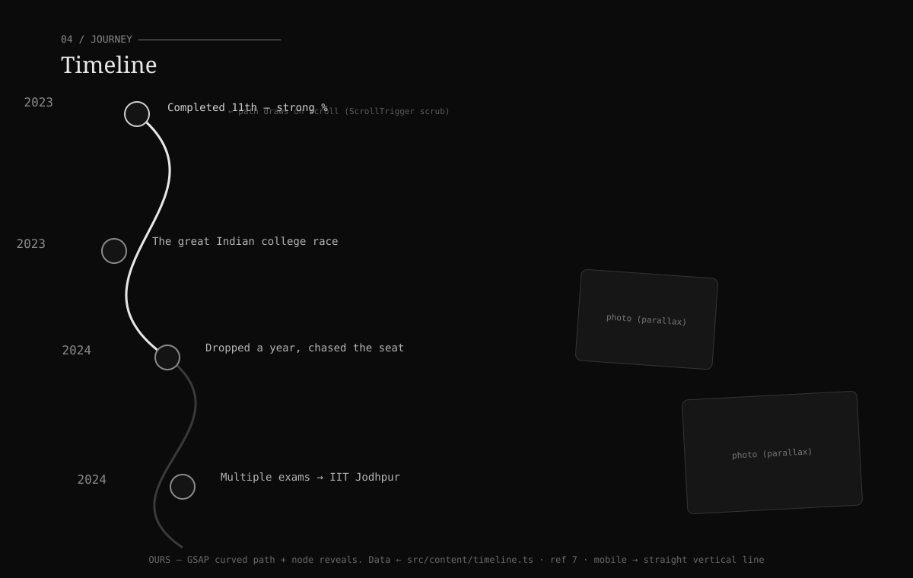

# Phase 2 — About & Timeline

**Status:** ◻ Specified · **Depends on:** P0 · **Sections:** About (`#about`) · Timeline (`#timeline`)

Both are **hand-coded (no 21st component)** — this is where our own GSAP work lives.

## Goal

- **About:** education (college + CGPA) and a short bio, delivered as rotated cards that
  translate in from the right on scroll.
- **Timeline:** the coding/career journey as a curved path with year nodes that draws as you
  scroll.

## Reference images

- About — `references/03-challenges-rotated-cards.png` (rotated card composition).
- Timeline — `references/07-curved-timeline.png` (curved line, year nodes, captioned photos).

## Blueprints

**About**



**Timeline**



## About — layout & data

```
<About> (#about)
  eyebrow "01 / About" + hairline
  grid [prose (left) | rotated cards (right)]
    prose: 2–3 sentence bio
    cards: education entries (rotated ±3–5°), enter from right on scroll
```

```ts
// src/twentysix/data/about.ts  (hand-authored — education isn't in content types)
interface EduCard { title: string; org: string; detail: string; period?: string; rotate: number; }
const bio: string
const education: EduCard[]   // e.g. IIT Jodhpur — BS Applied AI & DS — CGPA X.XX
```

**Motion:** each card `revealOnScroll({direction:"left"})` + slight rotation settle; stagger.
**Mobile:** cards stack vertically, rotation reduced to ~0–2°, prose above.

## Timeline — layout & data

Reuse existing data: `src/content/timeline.ts` (`TimelineEntry[]`, 2023→present — 11th,
college race, dropped year, IIT Jodhpur, Fiverr, LangChain PR, etc.).

```
<Timeline> (#timeline)
  eyebrow "04 / Journey"
  <svg> curved path (drawn via ScrollTrigger scrub)
  nodes: year label + title + body, alternating sides
  optional captioned photos with parallax
```

**Motion (GSAP + ScrollTrigger):**
- Path draw: `stroke-dashoffset` scrubbed to scroll progress.
- Nodes: reveal + scale as the draw passes each; `--t26-dur`.
- Photos: subtle parallax (`y` on scroll), disabled on mobile/reduced motion.

**Mobile:** curved path → straight vertical line on the left; nodes single-column; photos
inline, no parallax.

## Fallbacks / resilience

- Reduced motion: path shown fully drawn, nodes visible, no parallax.
- Missing timeline photo: `ImageWithFallback`.
- Empty timeline data: section hides its body, keeps heading (shouldn't happen — data exists).

## Files

- Create: `components/About.tsx`, `components/about/EduCard.tsx`, `data/about.ts`,
  `components/Timeline.tsx`, `components/timeline/TimelineNode.tsx`,
  `motion/timeline.ts` (path-draw helper, token-timed, reduced-motion gated).
- Modify: `TwentySixHome.tsx` (replace both placeholders); read `src/content/timeline.ts`.

## Acceptance criteria

- [ ] About shows education + CGPA + bio; cards animate in from the right.
- [ ] Timeline path draws on scroll; nodes reveal in order; data from `content/timeline.ts`.
- [ ] Mobile: cards stack; timeline is a vertical line.
- [ ] Reduced motion: everything visible, no scrub/parallax.

## Inputs needed

Exact CGPA + any school details for the About cards; optional timeline photos (fallbacks
cover absence).
