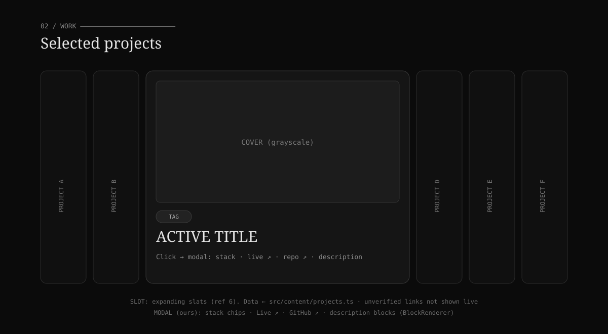
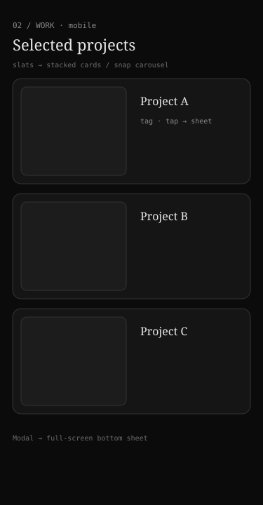

# Phase 3 — Projects

**Status:** ◻ Specified · **Depends on:** P0 · **Section:** Projects (`#projects`, placed right after About)

## Goal

Present selected projects as expanding slats; clicking one opens a modal with the stack, a
live link, a repo link, and the description.

## Reference image

- `references/06-expanding-slats.png` — vertical accordion; active slat expands to a wide
  image with tag + title + "VIEW PROJECT".

## Blueprints





## Layout & interaction

```
<Projects> (#projects)
  eyebrow "02 / Work"
  <SlatRow>                     ← slot (ref 6): row of vertical slats; hover/click expands one
    <Slat> × N                  ← collapsed = title (vertical); active = cover + tag + title + CTA
  <ProjectModal>                ← ours: opens on slat CTA
    cover · stack chips · Live ↗ · GitHub ↗ · description (BlockRenderer)
```

- Desktop: horizontal expanding slats; one active at a time.
- Mobile: slats → vertical stacked cards or a snap carousel; modal → full-screen bottom sheet.

## Data contract

Read from existing `src/content/projects.ts` (`Project[]`). Relevant fields already exist:

```ts
Project { title, tagline, stack: string[], links: ExternalLink[], cover?: AssetRef,
          blocks: ContentBlock[], status, rank, publish }
ExternalLink { kind: "live"|"repo"|..., url, verified }
```

- Order by `rank`; show `tier !== "recycled"` (recycled = the retro Recycle Bin).
- **Live/Repo buttons:** map `links` where `kind==="live"`/`"repo"`. **Unverified links are
  not rendered as live buttons** (honor `verified`) — show a muted, non-clickable label.
- Description: render `blocks` via `src/blocks/BlockRenderer.tsx`, or `tagline` as the short
  summary in the collapsed state.

## Motion

- Slat expand/collapse: width/opacity, `--t26-dur`, `--t26-ease`.
- Modal: scrim fade + panel rise; focus-trap; `Esc`/scrim closes; body scroll locked while open.
- Reveal the row on scroll (`revealStagger`).

## Mobile

- Cards stack full-width with a small cover thumb; tap opens the sheet.
- Sheet is full-screen, own scroll, close affordance top-right; no background scroll.

## Fallbacks / resilience

- Missing cover: `ImageWithFallback` (project initials).
- No live link / unverified: button hidden or shown disabled; repo-only projects still work.
- Empty projects list: section shows a short "work coming soon" note (shouldn't happen).
- Modal a11y: labelled dialog, focus trap, restore focus on close.

## Files

- Create: `components/Projects.tsx`, `components/projects/Slat.tsx` (slot wrapper),
  `components/projects/ProjectModal.tsx`, `data/projects26.ts` (selection/order adapter over
  `content/projects.ts`).
- Modify: `TwentySixHome.tsx` (replace placeholder).

## Integration slot

| Slot | Component (21st) | Ref |
|------|------------------|-----|
| `SlatRow` / `Slat` | expanding slats | 6 |

Modal is ours (not a slot).

## Acceptance criteria

- [ ] Slats render from `content/projects.ts`, ordered by rank.
- [ ] Active slat expands (desktop) / cards stack (mobile).
- [ ] Modal shows stack, live, repo, description; unverified links never live.
- [ ] Modal is accessible (focus trap, Esc, scroll lock).
- [ ] Reduced motion: instant expand/close, no transform easing.

## Inputs needed

The slats component (ref 6); confirmation of which projects to feature + their order.
