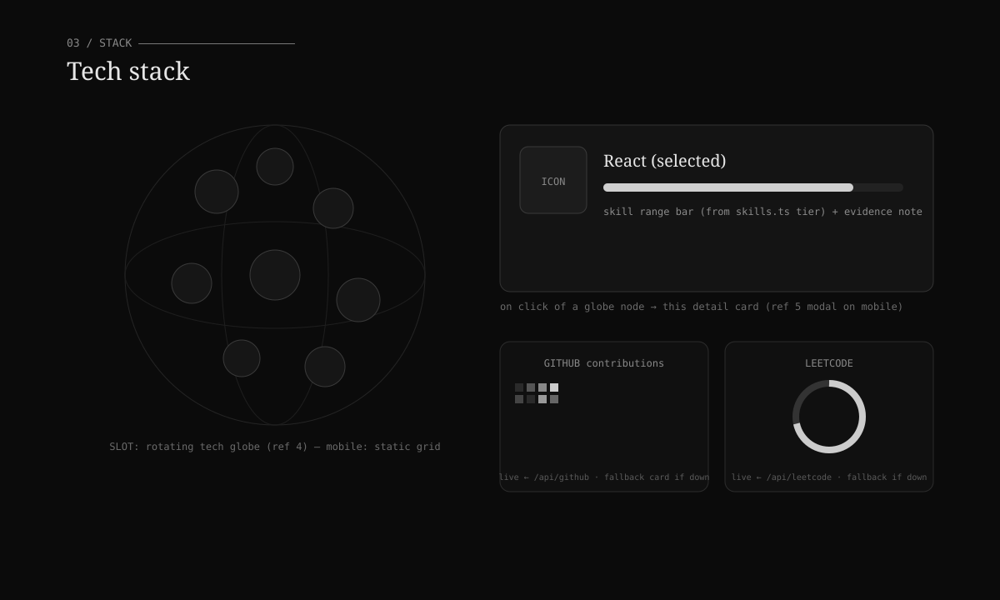

# Phase 4 — Tech Stack & Graphs

**Status:** ◻ Specified · **Depends on:** P0 + serverless API · **Section:** Tech stack (`#techstack`)

## Goal

A rotating globe of technology icons; clicking one shows the tech's icon and a skill-range
bar. Alongside, live **GitHub** and **LeetCode** graphs rendered in the monochrome system.

## Reference images

- Globe — `references/04-avatar-globe.png` (sphere of circular nodes).
- Detail modal — `references/05-detail-modal.png` (centered image + close + title/desc).

## Blueprint



## Layout

```
<TechStack> (#techstack)
  eyebrow "03 / Stack"
  grid [Globe | Detail+Graphs]
    <TechGlobe/>          ← slot (ref 4): nodes = tech icons; rotates; click selects
    <SkillDetail/>        ← ours: selected icon + name + skill range bar + evidence
    <Graphs/>             ← ours: GitHub contributions + LeetCode stats (mono)
```

- Desktop: globe left, detail + graphs right.
- Mobile: globe → static icon grid (perf/touch); tapping a tech opens the detail as a sheet
  (ref 5); graphs stack, heatmap scrolls horizontally in its own container.

## Data

- **Skills:** `src/content/skills.ts` (`Skill[]` with `tier: 1|2|3`, `category`, `evidence`).
  Map `tier` → bar fill; show one evidence line.
- **Tech list / icons:** `src/twentysix/data/tech.ts` — icon (inline SVG or `public/` asset)
  + link to matching `Skill.id`.
- **Graphs (live):** serverless endpoints below.

## Live graph API

Repo-root `api/` (Vercel serverless, deployed alongside the Vite build):

```
GET /api/github    → { weeks: {days:{date,count,level}[]}[], totals, error? }
GET /api/leetcode  → { solved:{easy,medium,hard,total}, calendar?, error? }
```

- `api/github.ts` — GitHub GraphQL `contributionsCollection`. Env `GITHUB_TOKEN` (read-only)
  + username. `Cache-Control: s-maxage=3600`. Returns `{error}` (never 500-crashes the UI).
- `api/leetcode.ts` — LeetCode public GraphQL (`matchedUser.submitStats`, `submissionCalendar`).
- Client fetches with a timeout + `AbortController`.

**Monochrome rendering (ours):** GitHub = grayscale contribution heatmap (levels mapped to
`--c-surface → --c-ink`); LeetCode = mono ring/stat tiles.

## Motion

- Globe rotation: slow auto-rotate; drag to spin (desktop); pauses on hover; off/omitted on
  reduced motion (static).
- Skill bar: width fill on reveal (`--t26-dur`).
- Graphs: cells fade/stagger in once; reduced motion = static.

## Fallbacks / resilience (critical here)

| Case | Behavior |
|------|----------|
| GitHub API down / no token / rate-limited | Skeleton → fallback card: "GitHub graph unavailable" + link to profile |
| LeetCode API down / user not found | Skeleton → fallback stat card + profile link |
| Slow network | Skeleton with timeout/abort; never blocks the section |
| Globe lib unavailable / low-power / reduced motion / mobile | Static icon grid |
| Missing tech icon | Monospace initials chip |

## Files

- Create: `components/TechStack.tsx`, `components/tech/TechGlobe.tsx` (slot),
  `components/tech/SkillDetail.tsx`, `components/tech/Graphs.tsx`,
  `components/tech/GitHubHeatmap.tsx`, `components/tech/LeetCodeStats.tsx`,
  `data/tech.ts`, `api/github.ts`, `api/leetcode.ts`, `lib/useFetchJson.ts` (timeout/abort).
- Modify: `TwentySixHome.tsx`; read `src/content/skills.ts`.

## Integration slot

| Slot | Component (21st) | Ref |
|------|------------------|-----|
| `TechGlobe` | avatar/icon globe | 4 |
| detail presentation | image modal (mobile) | 5 |

Skill bars + graphs are ours.

## Acceptance criteria

- [ ] Globe shows tech icons; selecting one drives the detail + skill bar.
- [ ] GitHub + LeetCode graphs render live in monochrome.
- [ ] Every API/globe failure shows a graceful fallback (demonstrated by blocking `/api/*`).
- [ ] Mobile: static grid; graphs stack; heatmap scrolls horizontally; no page overflow.
- [ ] Reduced motion: static globe/graphs.

## Inputs needed

GitHub username + a read-only `GITHUB_TOKEN`; LeetCode username; the globe component (ref 4);
tech icon set (or confirm inline SVGs).
