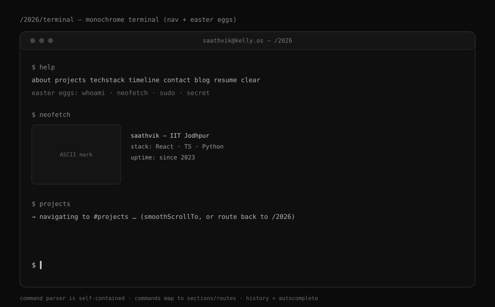

# Phase 6 — Terminal Page

**Status:** ◻ Specified · **Depends on:** P0 · **Route:** `/2026/terminal`

## Goal

A monochrome, interactive terminal opened from the dock: real commands that navigate the
portfolio, plus easter eggs for personality. Self-contained — **not** the retro
`TerminalWindow` (which is an in-OS fake shell).

## Blueprint



## Command set

**Navigation** (route to `/2026` and `smoothScrollTo` the section, or open a route):

| Command | Action |
|---------|--------|
| `about` / `projects` / `techstack` / `timeline` / `contact` | scroll to that section on `/2026` |
| `blog` | go to `/2026/blog` |
| `resume` | open the resume PDF |
| `home` | go to `/2026` top |
| `help` | list commands |
| `clear` | clear the screen |

**Easter eggs:** `whoami`, `neofetch` (ASCII mark + bio/stack/uptime card), `sudo` (playful
denial), `secret`/`konami`, `ls`, `cat <file>`. Unknown command → friendly hint.

## Implementation

```
<TwentySixTerminal> (own route, era canvas)
  <TerminalChrome>            titlebar, mono type
  <Output>                    history lines (commands + responses)
  <PromptInput>               caret, command entry
  parser: tokenise → command table → render response / navigate
  state: history[], up/down recall, tab-completion of command names
```

- Uses `smoothScrollTo` from `motion/scroll.ts` for section jumps.
- Pure client component; command table is data (`data/commands.ts`) so it's easy to extend.

## Motion / mobile

- Typed-output cadence optional (respect reduced motion → instant).
- Mobile: input focuses the on-screen keyboard; output scrolls; monospace stays legible;
  command chips as tap shortcuts for discoverability.

## Fallbacks / resilience

- Unknown command: hint, never a crash.
- Navigation to a section: if `/2026` isn't mounted, route there first, then scroll.
- Reduced motion: no typing animation; instant render.

## Files

- Create: `src/twentysix/pages/TwentySixTerminal.tsx`, `src/twentysix/data/commands.ts`,
  `src/twentysix/components/terminal/{Output,PromptInput}.tsx`.
- Modify: `src/App.tsx` (`/2026/terminal`); dock links here.

## Acceptance criteria

- [ ] Each nav command reaches the right section/route.
- [ ] Easter eggs work (`neofetch`, `whoami`, `secret`, …).
- [ ] History recall + tab completion.
- [ ] Mobile keyboard-friendly; chips aid discovery.
- [ ] Reduced motion: instant output.
