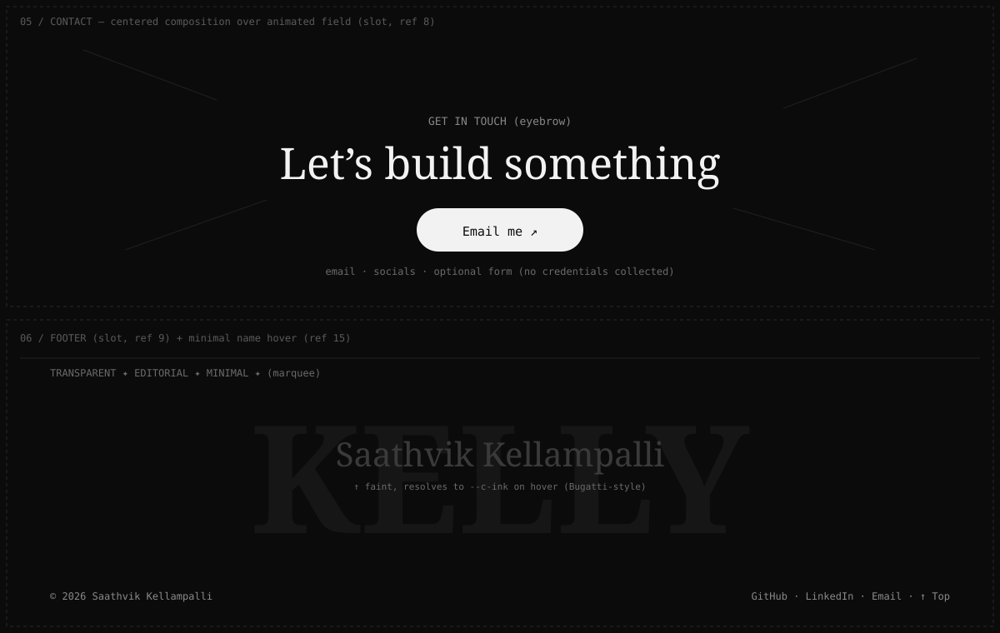

# Phase 7 — FX, Contact & Footer

**Status:** ◻ Specified · **Depends on:** P0–P6 · **Sections:** Contact (`#contact`) · Footer (`#footer`) + FX accents

## Goal

Integrate the remaining sent components: the contact section, the footer (with a Bugatti-style
minimal name hover), and the effect set placed as accents across the page.

## Reference images

| Ref | File | Placement |
|-----|------|-----------|
| 8 | `references/08-hyperdrive-hero.png` | Contact composition + animated field |
| 9 | `references/09-ready-footer.png` | Footer composition |
| 10 | `references/10-thin-line.png` | Hairline divider that draws between sections |
| 11 | `references/11-flickering-text.png` | Accent heading treatment |
| 12 | `references/12-flip-on-hinge.png` | Reveal transition for a heading/panel |
| 13 | `references/13-infinite-ribbon.png` | Marquee band between sections |
| 15 | `references/15-minimal-hover.png` | Footer name minimal hover |

## Blueprint



## Contact

```
<Contact> (#contact)
  <field/>              ← slot (ref 8): warp/particle background (mono)
  eyebrow + big headline + primary CTA (Email me ↗)
  secondary: socials
```

- **No credential/payment collection.** If a form is included, it only composes an email or
  posts a plain message — never collects sensitive data. Prefer a mailto/email CTA.
- Mobile: single column; field capped/disabled on low-power/reduced motion.

## Footer

```
<Footer> (#footer)
  top marquee (ref 13 optional)
  huge faint watermark word (grayscale)
  <MinimalNameHover/>   ← ref 15: name faint → resolves to --c-ink on hover
  links row: © · GitHub · LinkedIn · Email · ↑ Top
```

## FX accents (placement)

- **Line (10):** between major sections as a drawn hairline (ScrollTrigger).
- **Flicker text (11):** one accent heading (e.g. a section label) — used sparingly.
- **Flip-on-hinge (12):** a single heading/panel reveal — used once, not everywhere.
- **Ribbon (13):** one marquee band (e.g. before contact or footer).
- **Aether flow (14):** hero background (Phase 1) — referenced here for the FX inventory.

Rule: effects are seasoning. At most one per transition; never stack two on the same element.

## Motion / mobile / fallbacks

- All FX reduced-motion-gated (static or omitted).
- Mobile: marquee speed capped; flicker reduced; heavy fields off < 768px.
- Missing/failed FX component: section renders its static content without the effect.

## Files

- Create: `components/Contact.tsx`, `components/Footer.tsx`,
  `components/footer/MinimalNameHover.tsx`, `components/fx/{Line,FlickerText,FlipHinge,Ribbon}.tsx` (slots).
- Modify: `TwentySixHome.tsx` (replace contact + footer placeholders; place FX accents).

## Integration slots

| Slot | Component (21st) | Ref |
|------|------------------|-----|
| Contact field | hyperdrive/particle bg | 8 |
| Footer | ready-to-begin footer | 9 |
| Line / Flicker / Flip / Ribbon | fx set | 10–13 |
| MinimalNameHover | minimal hover | 15 |

## Acceptance criteria

- [ ] Contact shows headline + email CTA + socials; no sensitive-data collection.
- [ ] Footer shows watermark, minimal-hover name, links, back-to-top.
- [ ] FX are tasteful, ≤1 per transition, all reduced-motion-gated.
- [ ] Mobile: everything legible; heavy fields off; no overflow.

## Inputs needed

Components 8, 9, 10, 11, 12, 13, 15; contact email/CTA target.
